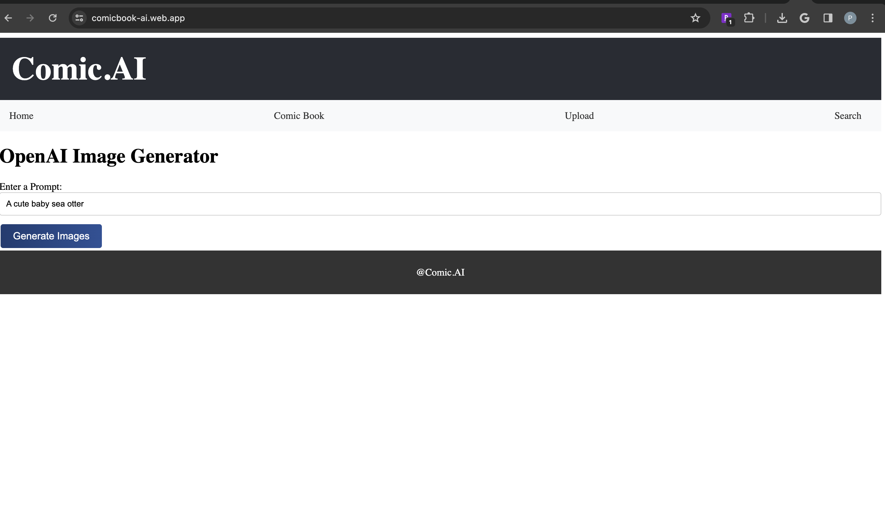
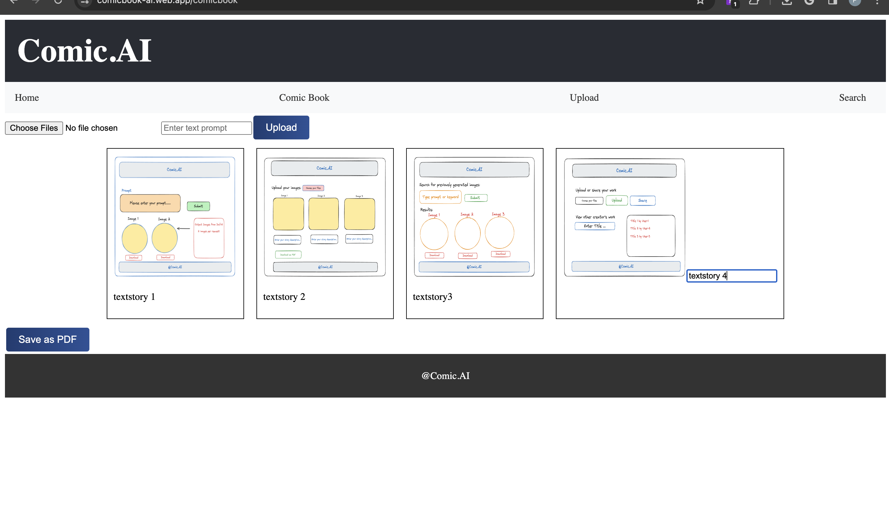
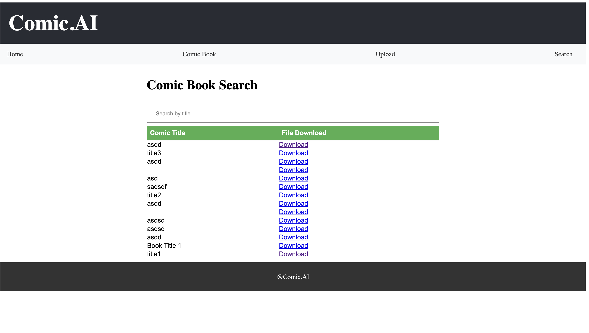

# Comic.AI

This app uses React-Vite along with Firestore and Firebase Hosting. The main idea of this app is to generate custom images based on user-prompts to craft unique comic book strips, this is achieved using OpenAI's Dall-E API which allows us to request images based on user-defined textual input. This program blends OpenAI's API along with React's functionality to allow users to craft their own stories, which can then be shared on social media or even be stored in the cloud-based storage provided by Firestore. 

The main functionalities are:
- 1. Generate custom images
- 2. Create custom comic strips
- 3. Download custom comics as pdf
- 4. Share comics on social media
- 5. Upload created comic on cloud-based storage
- 6. Search for already saved comics from the cloud-based database.

## Project Configuration
- Framework: React-Vite
- Database: Firestore Cloud
- Hosting: Firebase Hosting
- API's: DALL-E by OpenAI

## Getting Started

To get a local copy up and running, follow these simple steps.

1. Make sure you have the latest version of NodeJS installed using the command:

```bash
npm install npm@latest -g
```
2. Clone the repository using the following command:
```bash
git clone https://github.com/Pranav2501/ComicBook-AI.git
```
3. Move to the project folder using:
```bash
cd FolderName
```

3. To install package dependencies, use the following command:
```bash
npm install
```
4. To run the program:
```bash
npm run dev
```

5. If any errors, persist make sure you have Firebase installed:
```bash
npm install --save firebase
```
### Hosting
The project is currently hosted using Firebase, kindly use this link: https://comicbook-ai.web.app

### Video Demo
Project Video Link - https://northeastern.zoom.us/rec/share/R_WZ8jwsK53i9hzqNv81M2Sk83OdLR_yD9QOGWgNAl35y_Wx3ytFp_EvWHSq4D-a.GcxUv05I_rS868tZ?startTime=1712200631000
Passcode: 0bM9a&G&

Cypress Testing Video - https://northeastern.zoom.us/rec/share/kA4vKjtWmSVd2Iiidt_PP7lMStNX-FM5weymGZlzHgeKI6uZZ2c8XmJDwQsf3G8.ltu1Cs2H_DiqEldS 
Passcode: e2G&59mf

## E2E Testing - Cypress

The following application has E2E tests done using Cypress. Several usecases are tested which cover basic rendering and functionality of the applications.
The basic rendering components are header, footer, navbar, buttons, title & custom text. The functionality/use-cases like search, upload, download, generate, database operations, form submissions are all tested as well. The software tests are well-defined in the individual files, which are present in the Cypress Folder -> E2E testing -> 0-comicbookai-testing. The individual test-cases are defined at the top of each file using comments. Please refer to the video link to see the explaination and demo of the code.
### LICENSE

The project is licensed user MIT and is publicly available to all for use.


### Acknowledgments 
- Sources Used (YouTube) (OpenAI Integration Video)- https://www.youtube.com/watch?v=oacBV4tnuYQ
- Sources Used (YouTube) (Download Page as PDF)- https://www.youtube.com/watch?v=QaZ2CoYFO60
- OpenAI Documentation on Image Generation - https://platform.openai.com/docs/guides/images?context=node
- CS 5010 Programming Design Paradigms Course by Dr. John Alexis Guerra Gomez (Professor) & Mr. Ali Saremi (TA)


### Snapshots

Home Page

Comic Page

Search User Page



